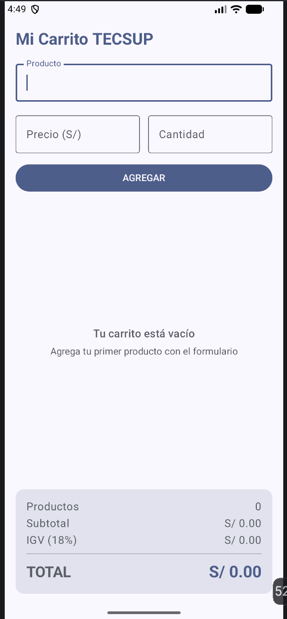
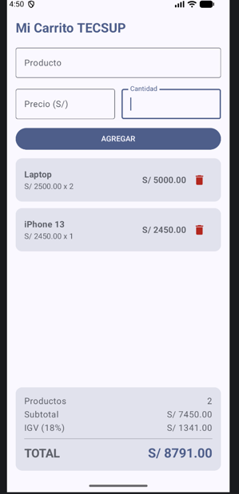

# Mi Carrito TECSUP – Laboratorio 04

**Autor:** Flores Valencia Jeanfranco
**Curso:** Programación en Móviles – 4to ciclo, Tecsup

## Descripción
Aplicación Android en Jetpack Compose que funciona como carrito de compras. Permite agregar productos (nombre, precio y cantidad) mediante un formulario, los muestra en una lista desplazable con `LazyColumn`, permite eliminarlos con un botón de tacho y calcula en tiempo real el subtotal, el IGV (18%) y el total. Cuando el carrito está vacío se muestra un mensaje centrado usando `Box`.

## Capturas

| Carrito vacío | Carrito con productos |
|---|---|
|  |  |

## Respuestas conceptuales

**a) ¿Por qué `mutableStateListOf` y no una `MutableList` normal?**
Porque `mutableStateListOf` crea una lista observable: Compose detecta cuando se agrega o elimina un elemento y vuelve a dibujar automáticamente los composables que la leen (la `LazyColumn`, el contador y los totales). Una `MutableList` normal sí cambia en memoria, pero Compose no se entera del cambio, así que la pantalla no se actualiza.

**b) ¿Por qué la lista se declara con `val` y aun así podemos agregarle elementos?**
Porque `val` solo impide reasignar la variable a otra lista distinta; no impide modificar el contenido de la lista. La referencia siempre apunta al mismo objeto `SnapshotStateList`, y lo que cambia son los elementos dentro de él mediante `add` y `remove`.

**c) ¿Qué hace `weight(1f)` en la `LazyColumn`?**
Hace que la lista ocupe todo el alto que sobra dentro de la `Column` después de medir el formulario y el panel de totales. Así la lista se desplaza dentro de ese espacio y el panel de totales queda siempre fijo en la parte inferior, sin ser empujado fuera de la pantalla.